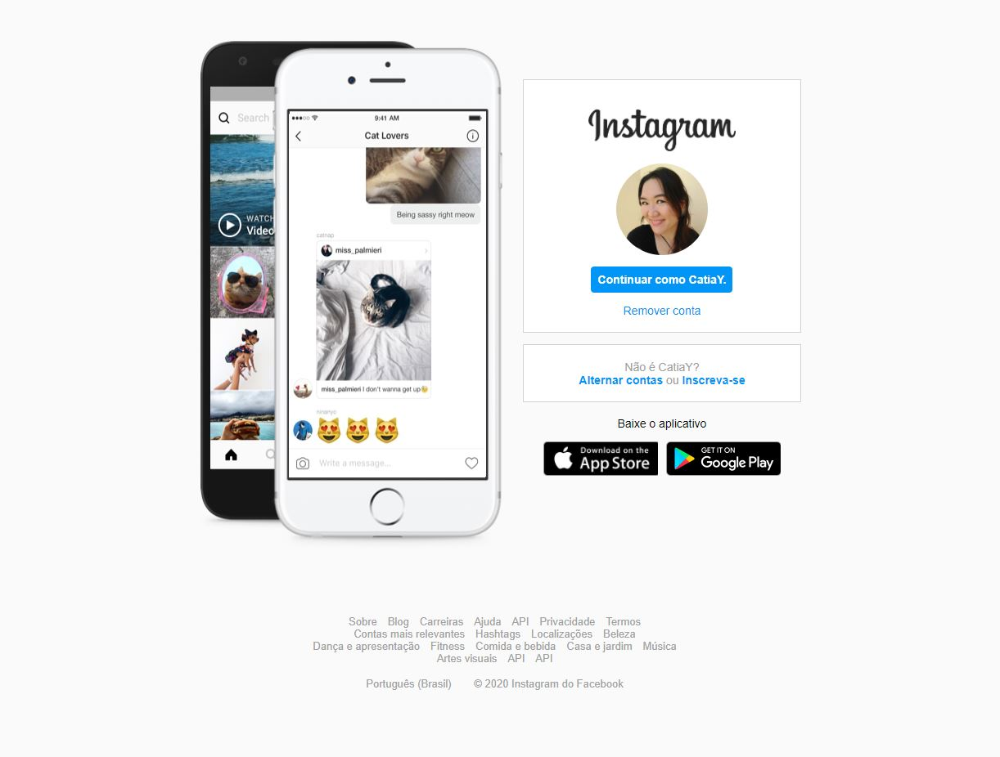
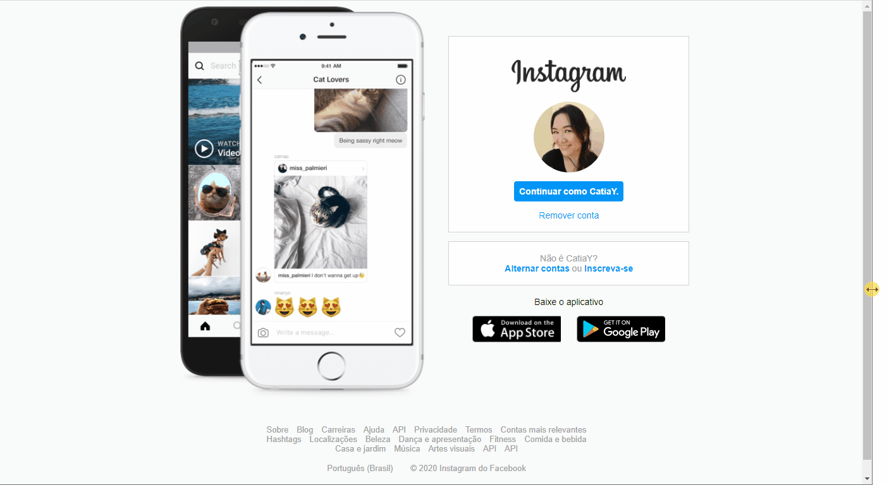

# Recriação da página inicial do Instagram utilizando CSS e flexbox com layout responsivo

Projeto adaptado a partir da aula "Recriando a página inicial do Instagram", do bootcamp da Digital Innovation One - Decola Dev Avanade 2021.

Tutora: Gabriela Pinheiro.

Implementação do rodapé.

&nbsp;

&nbsp;

&nbsp;

